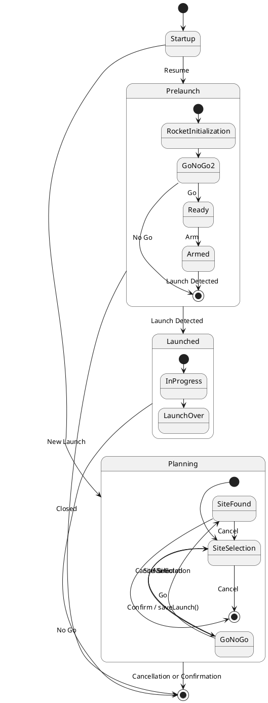

The logical architecture of the Mission Control System is designed around its features, with each feature being incorporated into a package with one-way dependencies. This is to facilitate high cohesion and low coupling, which will make the design more maintainable in the long run. Maintainability is a critical point of this design, as it is intended to be open-source software that serves a large community.

Each package has only one responsibility:

| Package | Responsibility |
| ------- | -------------- |
| OpenRocket | Go/No Go    |
| Persistence | Use case 5d |
| View | All the display items, including those used in Go/No Go and in the Rocket Status Display |
| Controller | The control flow of the application |
| External Data | Providing the data needed for the Go/No Go function |
| Avionics | Interfacing with the Rocket Avionics Package, to facilitate the Rocket Status Display and the arming process |
| Commons | Common data classes|

### External Data

```plantuml
interface MapData
class CachedMapData
class InternetMapData
class NOAAGetter

MapData <|-- CachedMapData
MapData <|-- InternetMapData

MapData : Image get(long, lat)

CachedMapData : Image cached
CachedMapData : CachedMapData(Image cached)

InternetMapData : Connection
InternetMapData : static bool available()

NOAAGetter : Connection
NOAAGetter : WeatherData getWeatherData()
NOAAGetter : static bool available()
```

### Avionics

```plantuml
CommandFormatter "1" *-- "1" SerialDriver
RocketListenerManager "1" *-- "1" SerialDriver
RocketListenerManager "1" *-- "1" DataInterpreter 

SerialDriver : bytes getDataBuffer()
SerialDriver : void sendBytes(bytes)

DataInterpreter : bytes buffer
DataInterpreter : void feedBytes(bytes)
DataInterpreter : RocketData nextEvent()

RocketListenerManager : List<RocketListener>
RocketListenerManager : void register(RocketListener)
RocketListenerManager : void unregister(RocketListener)

```

### Program State

