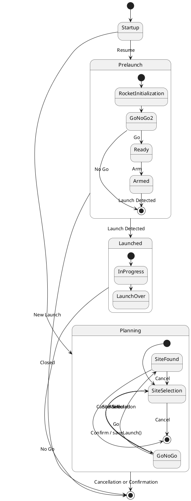

The logical architecture of the Mission Control System is designed around its features, with each feature being incorporated into a package with one-way dependencies. This is to facilitate high cohesion and low coupling, which will make the design more maintainable in the long run. Maintainability is a critical point of this design, as it is intended to be open-source software that serves a large community.

Each package has only one responsibility:

| Package | Responsibility |
| ------- | -------------- |
| OpenRocket | Go/No Go    |
| Persistence | Use case 5d |
| View | All the display items, including those used in Go/No Go and in the Rocket Status Display |
| Controller | The control flow of the application |
| External Data | Providing the data needed for the Go/No Go function |
| Avionics | Interfacing with the Rocket Avionics Package, to facilitate the Rocket Status Display and the arming process |
| Commons | Common data classes|

The logical architecture also uses the MVC (Model-View-Controller) paradigm to increase flexibility and maintainability.

### Avionics

```plantuml
CommandFormatter "1" *-- "1" SerialDriver
RocketListenerManager "1" *-- "1" SerialDriver
RocketListenerManager "1" *-- "1" DataInterpreter 

SerialDriver : bytes getDataBuffer()
SerialDriver : void sendBytes(bytes)

DataInterpreter : bytes buffer
DataInterpreter : void feedBytes(bytes)
DataInterpreter : RocketData nextEvent()

RocketListenerManager : List<RocketListener>
RocketListenerManager : void register(RocketListener)
RocketListenerManager : void unregister(RocketListener)

```

The Avionics Software Package contains the necessary classes to read and write data to the rocket. The public facing classes of this package are `RocketListenerManager` and `CommandFormatter`. The other classes could be made package-private as their functionality is internal, no other packages should be using the Serial Driver or the Data Interpreter to push or pull raw bytes. 

The instantiation of the public-facing classes is handled by a factory pattern that hides the construction of the underlying classes. 

This architecture could be extended to allow for different rocket types by subtyping `DataInterpreter` and `CommandFormatter`.

### External Data

```plantuml
interface MapData
class CachedMapData
class InternetMapData
class NOAAGetter

MapData <|-- CachedMapData
MapData <|-- InternetMapData

MapData : Image get(long, lat)

CachedMapData : Image cached
CachedMapData : CachedMapData(Image cached)

InternetMapData : Connection
InternetMapData : static bool available()

NOAAGetter : Connection
NOAAGetter : WeatherData getWeatherData()
NOAAGetter : static bool available()
```

The external data package is fairly straightforward, the main complication being the subtyping of `MapData`. This is to facilitate the internet and no-internet versions of the launch site view using a common type.

Both network-faing classes have an `available()` function to signal unavailability to the controller.

### Program State



The state of the program can be described as three separate states. 

| State | Description |
| ----- | ----------- |
| Planning | The initial launch site selection, which involves evaluating potential launch sites and their weather conditions for safety, with an internet connection |
| Prelaunch | The final checks done at the launch site, where an additional safety check is performed before the rocket is armed and launched |
| Postlauch | Tracking the rocket in flight, and recovery |

The `Planning` and `Prelaunch` stages aren't directly navigable, as they are performed at different locations. Howeber the `Prelaunch` and `Launched` stages are, as both stages occur at the launch site under the condition of no internet access.

Notably, the transition from `Planning` to `Prelaunch` involves significant caching of the weather data and the satellite imagery data for use in the field.