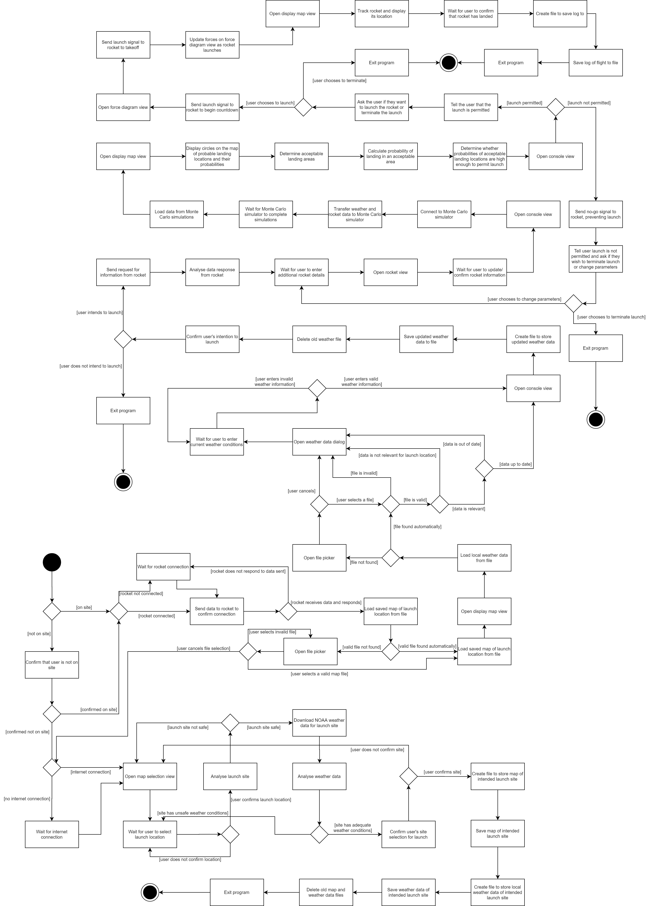

### 4.3 Process
The mission control program will contain swing UI elements. This means that the program has a thread that allows users to interact with the UI, and a thread that runs the core logic of the program. The core logic is single-threaded and only one instance of the program is allowed to be running on a computer at a time. As a result of this, concurrency is not an issue when it comes to the processes of the mission control program, but it does mean that only one rocket can be launched at a time using a single computer. However, there is no connection with different instances of the program on different computers, so multiple rockets can be launched at once using the program, as long as each rocket has a different computer. This also means that there is no synchronisation between instances of the program on different computers. The single-threaded, single-instance-per-computer nature of the mission control program allows for higher performance as no more than one instance of the program will run on a single computer. The program is also largely scalable as the processes the program undergoes are the same regardless of the hobby rocket.
  
The processes of the mission control software can perhaps best be described by the following activity diagram:
  

  
As discussed in 4.1 Logical, the program can be broken down into three primary superstates: planning, pre-launch and post-launch. The activity diagram can be broken down in a similar fashion. All activities that happen after the program confirms that the user is not at the launch site can be considered as planning activities. That is, activities that occur when the user is deciding on a launch site before the user is at the launch site. Likewise, all activities that occur after the user is at the launch site can be considered pre-launch activities with activities that occur after the launch signal is sent to the rocket considered as launch or post-launch activities. As can be seen from the activity diagram, the planning processes are completely separate from the pre-launch and post-launch processes. This is quite significant as it will alter the team's strategy when it comes to implementing the design of the mission control software as Java code.
