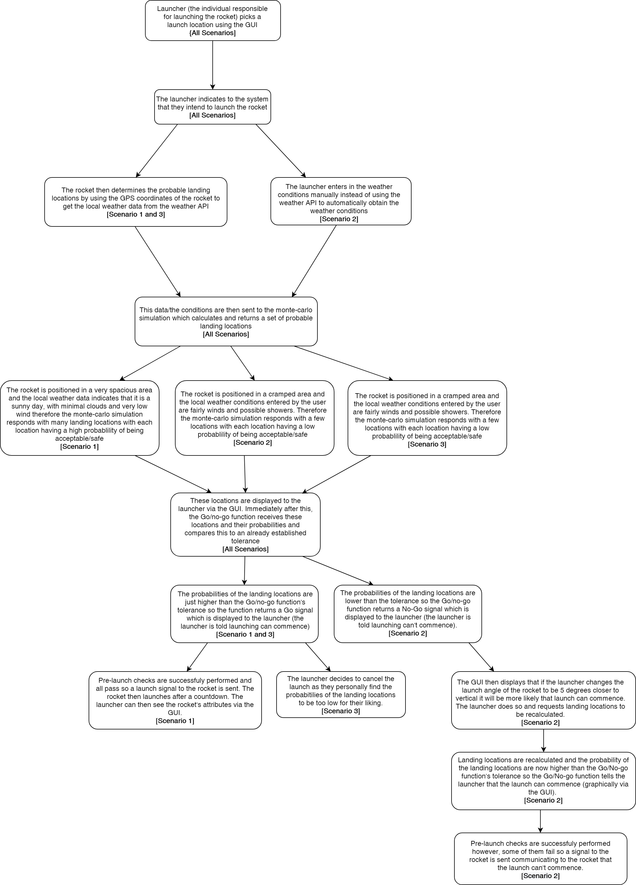

The scenarios described below revolve around two of our most important use-cases, "Determine probable landing locations" and "Go/no-go function".  
These two use-cases are described in detail in the [Project Requirements document](https://gitlab.ecs.vuw.ac.nz/course-work/engr300/2020/group9/group-9/-/blob/master/project_requirement/project-requirement.md) under Section 3.2.  
These two use-cases were chosen because they are very essential as they are both required for the minimum viable product.  
  
**Scenarios**  
  

**How the scenarios relates to the Logical View:**   
Throughout the scenarios the Launcher and system is interacting with the Controller package (the GUI), e.g. Launcher indicating to the system that they want to launch the rocket, the system updating the Controller package to show probable landing locations and the system updating the Controller package to tell the user if launching can commence.  
In the View package the class SelectMapView is utilized to show and allow the user to pick a launch location, in Scenario 1 the class DisplayMapView is used to show the rocket's attributes and the Weather data dialog class is used in Scenario 2 when the launcher enters in the weather conditions manually. Also the Console view is used in Scenario 2 as well when the pre-launch checks fail.  
The Avionics interface package (specifically the Serial Driver class and Listener Manager class) is used to send the launch/no-launch signal to the rocket.  
When communicating with the Monte-Carlo Simulation, the OpenRocket/Monte-Carlo class is used. The simulation file interface is used to interpret the data (probable landing locations) the Monte-Carlo simulation sends and the simulation listeners are used to detect this data.  
When obtaining the weather data using the weather API the External Data package is utilized (in particular the NOAA interface and MapDataRetriever and Map Data Interface). This weather data format is defined by 'Weather Data' in the Commons package
  
**How the scenarios relates to the Development View:**  
The scenarios also relate to the components described in the Development View. For example in Scenario 2, when the Go/No-go function says to the Launcher that it is not possible for the rocket to launch unless the Launcher changes the launch angle, this utilizes many components. These components include the Controller component (displaying to the launcher that launching can't commence and giving recommendations), the View component (Showing the Map view with the probable landing locations), the Observer component (Observing the change in launch angle) and the Model component (the Model updating in response to this angle change).  
The persistence component is also used in the scenarios to retrieve and store the Monte-carlo simulation data (with the Monte-carlo simulation also being a component) and the Network component is used to obtain the weather data from the weather API.  
In Scenario 3, also the Component model is used to communicate to the launcher that the launch has been cancelled.

**How the scenarios relates to the Process View:**  
All the processing in these scenarios (e.g. Obtaining the weather data from the weather API, showing the probable landing locations etc.) will be quick and with minimal delay since the Process View outlines that the core logic of our mission control program will be single-threaded so only one instance of it can be run on a computer at a time. Also parts of the scenario directly relate to the Process Activity Diagram.  
For example, when the launcher in Scenario 2 chooses to enter in the weather data this relates to the Open Weather Data dialog component of the activity diagram. Or when the local weather data is obtained from the weather API this relates to the "download NOAA weather data for launch site" and "Analyse weather data" components. One more example is when the system is interacting with the Monte-Carlo simulation in the scenarios this is directly related to the "Connect to Monte-Carlo Simulator", "Transfer rocket and weather data to Monte-Carlo simulator", "Load data from Monte-Carlo Simulations" components.
Most of the links between the activity diagram and the scenarios are self explanatory and can be easily seen.
  
**How the scenarios relates to the Physical View:**  
In regards to the physical view all the processing done in the scenarios will be executed in the mission control software that will run on a laptop. The monte-carlo simulation data is generated from the Monte-Carlo simulation software that will run on the same laptop so, these two programs on the laptop will communicate to each other. The Monte-Carlo simulation data likely will be stored in a file on this laptop. Also, when the laptop connects to the NOAA interface this interface requires the Internet to obtain the weather data.
