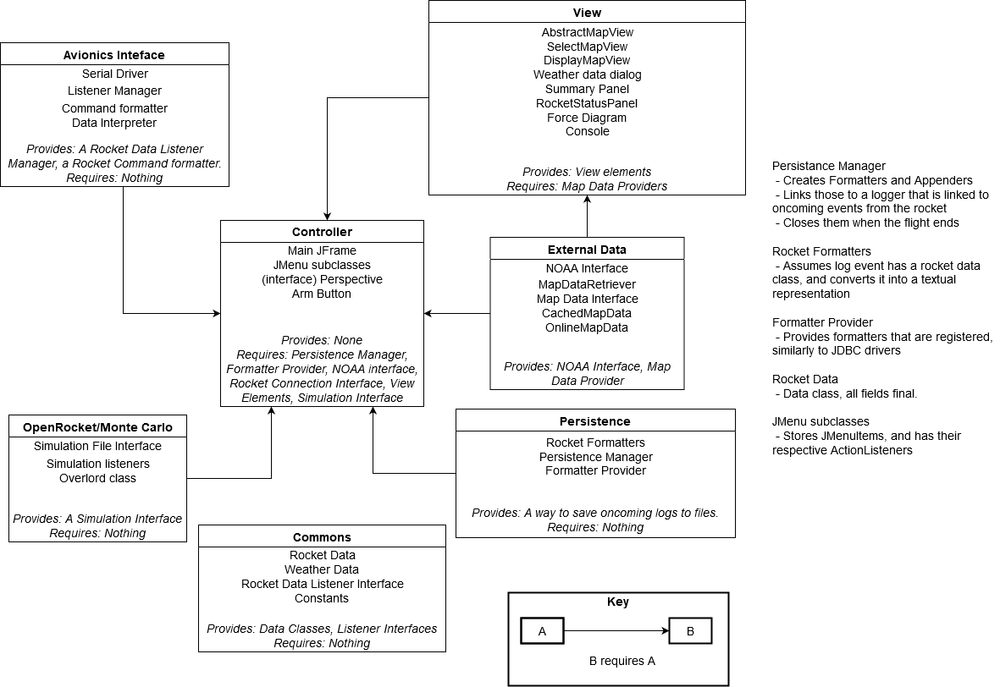

# ENGR 301: Mission Control Project Architectural Design and Proof-of-Concept

August Bolter, Claire Chambers, Bryony Gatehouse, Joshua Hindley, Bailey Jewell, Sai Panda

## 1. Introduction

### Client

Our client is Andre Geldenhuis, and he can be contacted via the ecs mattermost, or via email at andre.geldenhuis@vuw.ac.nz.

### 1.1 Purpose

Andre has contracted us to create mission control software for a hobby rocket launch, control, and recovery system. 

### 1.2 Scope

The Mission Control Software is a multirole software package that facilitates pre-launch, mid-launch, and post-launch activities.
It will identify favorable launch conditions, set the starting conditions for a rocket launch. 
During the launch it will monitor the rocket, reporting its status and position.
After the launch it will report the rockets position for manual recovery. 
This software will facilitate the goal of making hobby rocket launches safer for both the users and the community, as well as aiding in convenience tasks like recovery.


### 1.3 Changes to requirements

If the requirement have changed significantly since the requirements document, outline the changes here. Changes must be justified and supported by evidences, i.e., they must be substantiated. (max one page, only if required)

## 2. References

References to other documents or standards. Follow the IEEE Citation Reference scheme, available from the [IEEE website](https://ieee-dataport.org/sites/default/files/analysis/27/IEEE%20Citation%20Guidelines.pdf) (PDF; 20 KB). (1 page, longer if required)

## 3. Architecture

Describe your system's architecture according to ISO/IEC/IEEE 42010:2011(E), ISO/IEC/IEEE 12207, ISO/IEC/IEEE 15289 and ISO/IEC/IEEE 15288.

Note in particular the note to clause 5 of 42010:

_"The verb include when used in Clause 5 indicates that either the information is present in the architecture description or reference to that information is provided therein."_

This means that you should refer to information (e.g. risks, requirements, models) in this or other documents rather than repeat information.

### 3.1 Stakeholders
The stakeholders for this project are the general Hobby Rocket Community (i.e The New Zealand Rocketry Association) and Andre Geldenhuis.

Stakeholder concerns:

| **Stakeholder Concern**   |  **Effect Of Invalid Handling Of The Concern On The Stakeholder**  |
|---|---|
| System Integrity (Protection against unauthorised access)    | Unauthorised access could lead to unwanted rocket launches, potentially putting the stakeholders and civilians at risk of harm. Stakeholders could be held for ransom (the attacker could threaten to launch the rocket unless they get payment). As a result of these scenarios, the stakeholders trust in the developers will be diminished.   |
| Data Breaches  | If a stakeholder is designing a proprietary rocket, a data breach of logging information may lead to their design being stolen. |
|  Safety Hazards (I.e. while arming the ignition charge or incorrectly giving a GO for launch) | Serious injury can be caused, and the developers will be held liable. Possible harm to bystanders can be caused as the rocket can travel far in high winds.   |
|Use of deprecated libraries | The use of deprecated libraries should be avoided as they could possibly be removed in the future. Deprecated libraries are also known for having issues and being an inefficient method to complete their designated task. Using these libraries will affect performance of the stakeholder’s software and will leave it vulnerable to fatal errors. | 
|Use of open source libraries | Each open source library used in the software must be verified that it has a valid license. If this is not done before deployment, the software will under the law be no longer usable or distributable.   |

#### Software Life Cycle

##### Availability 
The mission control software will be available for use as long as the language level and libraries are non-deprecated. 

##### Security 
Special care will be taken during development to ensure that the software has high security. After development has finished, the project team will no longer be updating the code base and hence the security level will remain the same. 

##### Effectiveness 
The software will be as effective as the team can make it. During development, the aim will be to make the most effective and efficient version of the software. However, once the project is finished, new software for the same purpose by a different team may be available for use, which may surpass our software in terms of effectiveness and efficiency. 

##### Usability 
Much like the effectiveness of the software, the project team will aim to make the software as usable as possible. Our stakeholder age range is quite vast (from primary school kids to the elderly) so we need to be certain that the mission control software is easily usable by multiple age groups. 

##### Interoperability with Existing Systems
The mission control software is designed to interpolate with other projects being developed simultaneously. These projects are the Rocket Systems Engineering project and the Monte Carlo Rocket Simulation project. Our software is not aiming to be interoperable with any other existing systems besides those previously mentioned. 

##### Retirement 
If the decision to retire the software (i.e. it is deprecated) is made, then no sensitive data will need to be deleted / retained by the developers. This will rely upon on the stakeholders themselves as all logging data will be saved on their local machines as opposed to cloud storage. 

#### Support

Once the software is developed and deployed, support by the original development team will end for it. The code base will however be open source, so other developers and hobbyists may be available to extend or support the software. 

##### Obsolescence Management
As stated above, the software may be surpassed by newer effective software, which may leave our software obsolete. At this point, the development team may have a disclaimer on the repository to state that the software is now deprecated / obsolete. Unless other developers extend the code base, the software will forever be marked as such. 

#### Evolution of The Software System 

##### Adaptability 
Our software is going to be data agnostic, meaning that it will support multiple data formats. More specifically, these data formats are JSON, XML and CSV. As data formats evolve, a new and more effective data format may become available. While support for this new data format may be beneficial, the development team will not be updating the program to be able to handle it. This will again, be up to other developers and hobbyists who can extend the code base. 

##### Scalability 
During development, the team will increase its functionality based on the Stakeholders needs. This will not be the case after development, but the open source nature of the software will allow for others to increase the scalability of the program. 

##### Survivability 
The software will incorporate  multiple fail safes and will utilise proper handling of safety critical systems. In the event of an attack or a failure, the system will try to save as much information as it can and will try to minimise harm to anyone that can be affected. 


### 3.2 Architectural Viewpoints
(1 page, 42010 5.4) 

Identify the architectural viewpoints you will use to present your system's architecture. Write one sentence to outline each viewpoint. Show which viewpoint frames which architectural concern.

### 4. Architectural Views

### 4.1 Logical



The logical architecture of the Mission Control System is designed around its features, with each feature being incorporated into a package with one-way dependencies. This is to facilitate high cohesion and low coupling, which will make the design more maintainable in the long run. Maintainability is a critical point of this design, as it is intended to be open-source software that serves a large community.

Each package has only one responsibility:

| Package | Responsibility |
| ------- | -------------- |
| OpenRocket | Go/No Go    |
| Persistence | Use case 5d |
| View | All the display items, including those used in Go/No Go and in the Rocket Status Display |
| Controller | The control flow of the application |
| External Data | Providing the data needed for the Go/No Go function |
| Avionics | Interfacing with the Rocket Avionics Package, to facilitate the Rocket Status Display and the arming process |
| Commons | Common data classes|

The logical architecture also uses the MVC (Model-View-Controller) paradigm to increase flexibility and maintainability.

### Avionics

```plantuml
CommandFormatter "1" *-- "1" SerialDriver
RocketListenerManager "1" *-- "1" SerialDriver
RocketListenerManager "1" *-- "1" DataInterpreter 

SerialDriver : bytes getDataBuffer()
SerialDriver : void sendBytes(bytes)

DataInterpreter : bytes buffer
DataInterpreter : void feedBytes(bytes)
DataInterpreter : RocketData nextEvent()

RocketListenerManager : List<RocketListener>
RocketListenerManager : void register(RocketListener)
RocketListenerManager : void unregister(RocketListener)

```

The Avionics Software Package contains the necessary classes to read and write data to the rocket. The public facing classes of this package are `RocketListenerManager` and `CommandFormatter`. The other classes could be made package-private as their functionality is internal, no other packages should be using the Serial Driver or the Data Interpreter to push or pull raw bytes. 

The instantiation of the public-facing classes is handled by a factory pattern that hides the construction of the underlying classes. 

This architecture could be extended to allow for different rocket types by subtyping `DataInterpreter` and `CommandFormatter`.

### External Data

```plantuml
interface MapData
class CachedMapData
class InternetMapData
class NOAAGetter

MapData <|-- CachedMapData
MapData <|-- InternetMapData

MapData : Image get(long, lat)

CachedMapData : Image cached
CachedMapData : CachedMapData(Image cached)

InternetMapData : Connection
InternetMapData : static bool available()

NOAAGetter : Connection
NOAAGetter : WeatherData getWeatherData()
NOAAGetter : static bool available()
```

The external data package is fairly straightforward, the main complication being the subtyping of `MapData`. This is to facilitate the internet and no-internet versions of the launch site view using a common type.

Both network-faing classes have an `available()` function to signal unavailability to the controller.

### External Data

```plantuml
class JPanel {
   Provided
}

class JDialog {
   Provided
}

abstract class AbstractMapView
class SelectMapView
class DisplayMapView
class ForceDiagramView
class ConsoleView
class RocketDataView

JPanel <|-- AbstractMapView
JPanel <|-- ForceDiagramView
JPanel <|-- ConsoleView
JPanel <|-- RocketDataView

AbstractMapView <|-- DisplayMapView
AbstractMapView <|-- SelectMapView

JDialog <|-- WeatherDataDialog
```

All view classes extend provided swing components, most often `JPanel` and `JDialog`. Notably, there's the abstract `AbstractMapView` which provides a base for both the select map views (used in the planning stage), and the display map views (used in the launching stage).

### Program State


The state of the program can be described as three separate states. 

| State | Description |
| ----- | ----------- |
| Planning | The initial launch site selection, which involves evaluating potential launch sites and their weather conditions for safety, with an internet connection |
| Prelaunch | The final checks done at the launch site, where an additional safety check is performed before the rocket is armed and launched |
| Postlauch | Tracking the rocket in flight, and recovery |

The `Planning` and `Prelaunch` stages aren't directly navigable, as they are performed at different locations. Howeber the `Prelaunch` and `Launched` stages are, as both stages occur at the launch site under the condition of no internet access.

Notably, the transition from `Planning` to `Prelaunch` involves significant caching of the weather data and the satellite imagery data for use in the field.

### 4.2 Development

#### 4.2.1 Design Pattern

Project is based on the MVC (model, view, controller) design pattern. The Controller package depends on the other packages, while the other packages don't depend on anything else. This means that only the Controller package is affected by run-on package changes. This pattern was chosen as it was known by all team members allowing conversation about the various components to be easy to understand for everyone, and it forces separation of most packages, reducing dependancies.

#### 4.2.2 Model Kind

The Component Diagram is a Structural Model which is a representation that shows the arrangement of elements with respect to each other and where necessary shows the interfaces between elements and with external entities. Such a model enables consolidating or identifying the physical interfaces between system elements in a level of the system hierarchy and between levels of the system hierarchy, as well as those with external entities to the concerned system (in its environment/context).

The external entities in the system are the Monte Carlo system that will be created by another student team (teams 13 - 18) and the Observer which creates a back loop from the Model to the Controller.

#### 4.2.3 Components

##### Controller

Controls the GUI, recieves the information from the users (via the interface), and mediates the information passes between model and view.

##### Model

Controls the logic of the program, holds all the saved information (apart from info saved into files).

##### View

Controls what is shown to the user (interface).

##### Persistence

Saves information to files, reads information from files.

##### Network

Gets information from network-connected external entities, sends information to network-connected external entities.

##### Monte Carlo (NOT OUR CODE)

Simulates the launch to check for probability of acceptable launch. 

##### Observer

Communicates information back to the Controller from the Model, follows the Observer Design Pattern.

#### 4.2.3 Model v 1.2


### 4.3 Process

The mission control program will contain swing UI elements. This means that the program has a thread that allows users to interact with the UI, and a thread that runs the core logic of the program. The core logic is single-threaded and only one instance of the program is allowed to be running on a computer at a time. As a result of this, concurrency is not an issue when it comes to the processes of the mission control program, but it does mean that only one rocket can be launched at a time using a single computer. However, there is no connection with different instances of the program on different computers, so multiple rockets can be launched at once using the program, as long as each rocket has a different computer. This also means that there is no synchronisation between instances of the program on different computers. The single-threaded, single-instance-per-computer nature of the mission control program allows for higher performance as no more than one instance of the program will run on a single computer. The program is also largely scalable as the processes the program undergoes are the same regardless of the hobby rocket.
<br><br>
The processes of the mission control software can perhaps best be described by the following activity diagram:
<br><br>

<br><br>
As discussed in 4.1 Logical, the program can be broken down into three primary superstates: planning, pre-launch and post-launch. The activity diagram can be broken down in a similar fashion. All activities that happen after the program confirms that the user is not at the launch site can be considered as planning activities. That is, activities that occur when the user is deciding on a launch site before the user is at the launch site. Likewise, all activities that occur after the user is at the launch site can be considered pre-launch activities with activities that occur after the launch signal is sent to the rocket considered as launch or post-launch activities. As can be seen from the activity diagram, the planning processes are completely separate from the pre-launch and post-launch processes. This is quite significant as it will alter the team's strategy when it comes to implementing the design of the mission control software as Java code.

### 4.4 Physical 


The mission control software does not require a complex physical system. The application can run on a standalone machine, requiring no communication with other physical servers for basic operation.

#### Local Machine
The local machine is a standard laptop equipped with a keyboard and trackpad, capable of running the mission control software. It can run on battery power in the field and has a display capable of accomodating the user interface of the application comfortably. 

#### Internet Connection
Internet access is required in the planning state but is not required for the pre-launch and launched states.

#### USB Serial Connection
Data is recieved from the rocket over a USB serial connection during the pre-launch and launched states. This is not required in the planning state. 


### 4.5 Scenarios
...

## 5. Development Schedule

_For each subsection, make clear what (if anything) has changed from the requirements document._ If unchanged, these sections should be copied over from the requirements document, not simply cross-referenced.

Schedules must be justified and supported by evidences; they must be either direct client requirements or direct consequences of client requirements. If the requirements document did not contain justifications or supporting evidences, then both must be provided here.

### 5.1 Schedule

This project consists of three primary deliverables: an architechure prototype, a minimum viable product and the project termination. The architectural prototype should be completed by the 19th of June in week eleven of trimester one. Our team chose this date for the architectural prototype as it signifies the end of the first trimester and the end of the planning stage of the mission control project. After this deliverable has been delivered, the team can begin programming the mission control software, creating a skeleton proof of concept before arriving at a minimum viable product. The minimim viable product for our project is a program that can act as mission control for a hobby rocket launch without any bells and whistles. The minimum viable product should be fully functional, if bare-bones, in successfully allowing a user to launch a hobby rocket. Our team should deliver the minimim viable product by the 14th of August in week five of trimester two. We chose this date as it allows the team sufficient time to create the mission control program while also allowing plenty of time to receive feedback from the client and make changes and improvements the the product. The project should terminate on the 16th of October in week twelve of trimester two. Ideally, the complete version of the product should be finished much earlier and only minor quality-of-life changes should be made the the mission control program in the weeks leading up to the project termination. At this stage there are no plans for any further releases beyond project termination. 

### 5.2 Budget and Procurement

#### 5.2.1 Budget

No purchases required as the project is software-based.

#### 5.2.2 Procurement

| Good/Service  | Procurement Method | Fulfilment of Project Goals |
| ------        | ------ | ------ |
| GitLab        | GitLab is a lifecycle tool and repository manager and was procured from the School of Engineering and Computer Science. | GitLab was provided to our team from the School. Using GitLab hugely increases the simplicity of collaboration and version management. Additionally, GitLab allows for milestones and epics and allows for pipelines to be added for continuous integration and continuous deployment (CI/CD). GitLab allows the team to create issues for different areas of the project and assign team members to each issue. Using GitLab allows for the project files to be well organised and maintained and allows for planning and discussion to occur before code is written or commits are made. This results in generally higher quality, more understandable work in both reports and code. |
| Eclipse       | Eclipse is an integrated development environment (IDE) and was procured from [here.](https://www.eclipse.org/) | Several, but not all, team members have experience using Intellij, while all team member's have experience using Eclipse. We chose, as a group, to have all members program the mission control software using the same IDE. Since all team members have experience with Eclipse, we chose Eclipse as our IDE. All team members using the same IDE allows for consistent project files across all member's machines. Having consistent project files speeds up development and integration and increases the likelihood of the team successfully completing the project. |
| Maven         | Apache Maven is a software project management and comprehension tool and was procured from [here.](https://maven.apache.org/) | Using Maven allows for simple library management where library dependencies are declared in a project object model (POM) file. The libraries are located at a central Maven repository and are downloaded when the project is run on the command line using Maven commands (e.g. mvn clean install). Using a Maven project instead of a standard Java project in Eclipse allows for additional libraries to be added and used simply and will result in all team members having the same libraries available to them. This will reduce library conflicts and speed up development, resulting in more consistent project files and a higher likelihood of successful completion. |
| Google Checks | Google Checks is a checkstyle tool used to enforce a consistent coding standard across a project. Google Checks is procured as an option through Eclipse, which will be activated. | Using Google Checks (or any checkstyle tool for that matter) allows for consistency in code style across code written by all team members. Consistency is key when it comes to programming style as consistency and naming conventions are some of the primary parts of the understandability of code. As such, using Google Checks should allow our team to produce code that is consistent in style and is easily understandable. |


### 5.3 Risks 

#### Sudden prolonged absence of a team member.
##### Likelihood: Low Effect: High.

The sudden prolonged absense of a team member is a schedule risk that can cause the project to run overtime. It is caused when a team member disappears for a long period without explanation. An example is if a team member is in a crash and is in a coma.

The impact of a sudden prolonged absense of a team member is that there is one less person working on the project. This means that that member's work would have to be split between the other team members and the project will take more time and effort to complete. 

To avoid the risks of a sudden prolonged absence, each team member will strive to:
- Offer an explanation if they are going to be absent.
- Add comments and notes into their work so it is easier for others to pick up.

To avoid the risks of a sudden prolonged absence of a team member, the team will strive to:
- Make sure each member knows about every different part of the project so they can start working on it.
- Have regular meetings with compulsory attendance to quickly notice a team member's absence.

#### Sudden temporary absence of a team member.
##### Likelihood: Medium/High Effect: Low

The sudden temporary absence of a team member is a schedule risk that could cause decisions to be delayed. It is caused when a team member fails to remember a meeting, and is contactable during the meeting. An example is when a team member schedules their work during the meeting, thus is busy and away from their device.

The impact of a sudden temporary absence of a team member is that a decision isn't able to be made. This will halt progress on the project, potentially pushing it back past the deadline. 

To avoid the risks of a sudden temporary absence, each team member will strive to:
- Check the communication channel at least once a day.
- Avoid booking commitments during the lab times.
- Be available on the communcation channel during lab times.

To avoid the risks of a sudden temporary absence of a team member, the team will strive to:
- Have regular meetings at the same time every week.
- Notify team members about meetings outside of normal scheduled meetings at least a day before the meeting.
- Keep important decisions to the normal scheduled meetings.

#### Loss of work due to technological problems.
##### Likelihood: Medium Effect: Low

Loss of work due to technological problems is a scheduling risk that could lead to the project not being finished on time. It is caused when a technological problem causes the file that was being worked on to be closed without saving the work. An example is when a blackout causes the desktop to shutdown before the file was saved. 

The impact of losing work due to technological problems is that work will have to be repeated. This might result in the final code being poorly written as the developer isn't thinking as hard about it. It will result in more work and time taken on the task. If the work lost is a lot, than it could delay the finishing of the project. 

To avoid losing work due to technological problems, each team member will strive to:
- Save their work regularly to keep an almost up-to-date version of their work.
- Work on all their work seriously, even if they are repeating it.
- Commit regularly to GitLab to protect against their device dying.

To avoid losing work due to technological problems, the team will strive to:
- Split tasks into smaller units so work done each 'task' is less.

#### Failure to agree on protocol with the Monte Carlo teams. 
##### Likelihood: High      Effect: High

Failure to agree on protocol with the Monte Carlo teams is a performance risk that would stop the project from integrating with them. It would be caused by a disagreement with all the Monte Carlo teams over how the two projects will communicate. An example is this project not wanting to send a piece of information the Monte Carlo team were expecting.

The impact of failing to agree on protocol with the Monte Carlo teams is being unable to simulate the rocket's launch. This would lead to the system being unable to determine if a launch is safe.

To avoid failing to agree on protocol with the Monte Carlo teams, the team will strive to:
- Be willing to make compromises on agreements. 
- Outline what the system can actually do.
- Don't accept impossible terms. 

#### Failure to agree on protocol with the avionics teams. 
##### Likelihood: High      Effect: High

Failure to agree on protocol with the avionics teams is a performance risk that would stop the project from integrating with them. It would be caused by a disagreement with all the avionics teams over how the two projects will communicate. An example is the avionics team wanting to send information that this project doesn't want to deal with.

The impact of failing to agree on protocol with the avionics teams is being unable to connect to the rocket. This would lead to the user not being able to control the rocket, or see information about the rocket's position. 

To avoid failing to agree on protocol with the avionics teams, the team will strive to:
- Be willing to make compromises on agreements.
- Outline what the system can actually do.
- Don't accept impossible terms.

#### Other teams fail to meet deadline. 
##### Likelihood: Low       Effect: High

The other teams failing to meet deadlines is a schedule risk that would halt the testing or development of the project. This risk would only happen if all of the six teams working on the Monte Carlo/avionics project are all behind schedule. 

The impact of the other teams failing to meet deadlines is that the project deadlines will have to be pushed back to accomondate them. This will cause the project to be completed later than expected, and the team will be waiting around for it to be completed. 

To avoid the other teams failing to meet deadlines, the team will strive to:
- Clearly express when a component from another team is needed.
- Check up regularly on the progress of the component.

#### Failure to meet deadlines. <br>
##### Likelihood: Medium     Effect: Low

Failure to meet deadlines is a schedule risk that can cause the project to run overtime. It is caused when some factor prevented the individual from completing their work. This could be due to having too much work on at a certain time, or a sudden external event like a blackout or injury. An example is when a team member has to fit in the project work while also studying for a test.

The impact of a deadline being missed is that the other parts of the project will be behind schedule. These effects could make the project be completed later than expected or cause extra pressure on the the rest of the team to fix the individual's mistake.

To avoid failing to meet deadlines, each team member will strive to:
- Only take on the amount of work they can physically complete within the time limit.
- Be willing to help others when they are struggling with a task.
- Be willing to ask others for help when they are struggling with a task.
- Be honest about the amount of other work they have to complete.
- Share if they have other circumstances preventing them from working early.

To avoid a team member failing to meet deadlines, the team will strive to:
- Plan work around other obligations or deadlines. 
- Have slack in the schedule so delays don't throw the project off track.

#### Major scope creep.<br>
##### Likelihood: Medium/Low    Effect: High

Major scope creep is a cost risk that can cause the project to run overtime. It is caused when extra tasks are added to the project scope during the project lifetime, or when nominally simple functions are continually over-created. An example is when another requirement is added to the project specification.

The impacts of major scope creep are extensions to the project lifetime or extra work to the team to fit into the same lifetime.

To avoid major scope creep, the team will strive to:
- Carefully define the project specifications so there is no room for confusion. 
- Focus on finishing the project requirements before adding extra functions.
- Review the code regularly to spot wasted code early.
- Communicate about tasks.

#### Bad documentation.<br>
##### Likelihood: Medium/High   Effect: Medium/Low

Bad Docmentation is a performance risk that can cause bugs in the program. It is caused when an individual fails to properly document their methods or classes. An example is when a developer fails to properly add comments and JavaDocs to their method.

The impact of bad documentation is that the method is incorrectly used or that the code is confusing to developers who are editing it. These effects could lead to bugs in the program which will increase the work for developers and testers and increase the time/cost of maintaining the program or adding new features.

To avoid bad documentation, each team member will strive to:
- Write a JavaDoc comment for every method.
- Add important comments to their code so that it can be understood by other team mates.
- Make sure that documentation can be understood by outsiders. 

#### Injuries due to overwork. <br>
##### Likelihood: Medium     Effect: Medium

Overwork is a physical risk that can, in unlikely circumstances, cause death. It is caused when an individual works for an extended amount of time without decent rest or food. An example is when a student pulls an all-nighter for multiple consecutive days to finish an assignment or study for a test. 

The more likely impacts of overwork, other than death, are sleeping disorders, anxiety, and a weakened immune system. These effects will reduce the work quality of the individual and potentially stop them from working on the project.

To avoid becoming overworked, each team member will strive to:
- Only take on the amount of work they can physically complete within the time limit.
- Be willing to help others when they are struggling with a task.
- Be willing to ask others for help when they are struggling with a task.
- Be honest about the other work they have to complete.

To avoid a team member becoming overworked, the team will strive to:
- Share the work between the team so no one's doing all the work.
- Be flexible with deadlines.
- Work around deadlines for other courses.

#### Computer-use related injuries.<br>
##### Likelihood: Low        Effect: High

Computer-use injuries are a physical risk that can lead to the individual not being able to use the computer. They are caused by continued use of a computer while using poor posture or repeating a similar action for a long period of time. Poor posture could be slouching, sitting straight upright, typing with a positive slope, looking down at the monitor or looking up at the monitor. 

The impacts often noticed of poor computer-use are back/neck pain, headaches, and arm pain. These effects could make the individual uncomfortable using the computer, thus reducing their speed or output, or making it too painful to use the computer at all.

To avoid a computer-use injury, each team member will strive to:
- Take regular breaks away from the computer during work to allow the body to stretch and relax.
- Stop working if something starts hurting and allow time for it to return to normal. If it doesn't, they should see a doctor.

To avoid a team member getting a computer-use injury, the team will strive to:
- Reduce length of online meetings.

### 5.4 Health and Safety

1. How the team will manage computer-related risks
    - Some risks were discussed in great detail in the section above (overwork, computer-use injuries, work loss due to technological problems).
    - Cable Management
        - Each team member will strive to keep their work station free of loose wires.
    - Security
        - No sensitive or personal data is stored or used by the program.
        - GitLab.ecs prevents people outside the university from accessing the online work.
    - Other risks
        - Up to team members to identify and mitigate depending on their unique situation.
        - Team members can ask for advice or help from other team members or the School Safety Officer.
        - Team members should share risks they've found with the team.

2. Whether the project requires any work or testing at an external (off-campus) site.
   - The project is a control for a rocket, but can be tested at an internal site using simulations. Thus it won't require off-campus testing.
   - Note: it will require testing under field conditions (no wifi) but doesn't need to be in the field.


#### 5.4.1 Safety Plans

As this is a software project, project requirements do not involve risk of death, serious harm, harm or injury.


## 6. Appendices

### 6.1 Assumptions and dependencies 

One page on assumptions and dependencies (9.5.7) 

### 6.2 Acronyms and abbreviations

One page glossary as required 

## 7. Contributions

An one page statement of contributions, including a list of each member of the group and what they contributed to this document.
