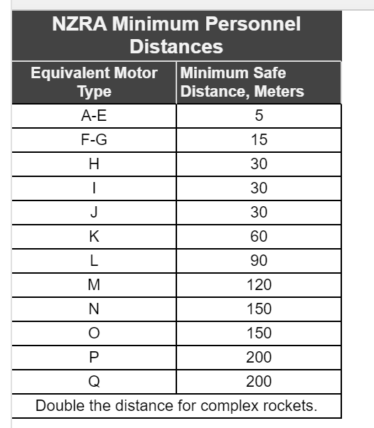

### Regulatory 

The regulations our rocket needs to follow depends on the motor power range of the rocket.

Motor power range is determined by the minimum safe distance (in meters). 
Motor power range A-D can use the regulations as a guide, E-F need to follow the regulations and G+ need to follow additional regulations as well.

The regulations are specified in the NZ Rocket Association website (https://www.nzrocketry.org.nz/rocketry/rocket-safety).
It is ideal for our software to be flexible (to work with any rocket). Therefore, our software for the rocket should conform with regulations specified for motor power range G+ since if the software is suitable for G+ it will also be suitable for motor power ranges below G.

### Hardware
There are a few potential hardware limitations such as: 

*  The rocket not having internet at the launch site which could impair our software’s ability to get weather data.
*  The launch site could also be outside the range for GPS communication which would affect the rockets' GPS ability.
*  The rocket will be controlled in the air by gimballing the motors however, this will only work while the motor is burning
*  The accelerometer the rocket will use needs to be powered by a stable, constant current supply to reduce noise on the signal generated by it.

### Interfaces to other applications
The rocket will have various sensors so, it is important to make sure our software accounts for the delay and range these sensors will have.
Our software also has to account for the transmission time for sending the weather data to the monte carlo and for receiving information about the rocket (e.g. GPS locatio)

### Parallel operation
If the rocket uses transformers that operate in parallel there are a few limitations associated with this such as:
*  Increasing the necessary breaker capacity
*  Could potentially create circulating currents running from one transformer to another which will diminish load capability and increased losses.

### Audit functions
Our software will need to be 'audited' (i.e. checked that it is working as intended). Functions created in auditing tools such as JUnit are limtied by the language they are written in and the functionality of the tool itself.

### Control functions
The control functions in our software determines whether it is safe for the rocket to launch (e.g. Go no-go function) however, once the rocket is in flight our software has no control over it (can't affect its' movement)

### Higher-order language requirements:
Our software will likely be written in Java. Java like any other language has limitations such as;
*  Memory allocation and garbage collection being automatic (means the user has less control over their software)
*  Java compiler being not as well optimised as compilers for other languages (e.g. C++)
*  User interface libraries in Java such as Swing are limited in customability and functionality.

### Signal handshake protocols
The rocket will use signal handshake protocols such as TCP 3-way-handshake to establish connections between its' interfaces. The limitation of this is performing the handshake isn't instantenous so the communication between interfaces will have a delay.

### Quality requirements
Our software for the rocket and the rocket itself will be limited in the sense that they will need to conform to quality requirements (e.g. reliability).

### Safety and security considerations
Our software for the rocket and the rocket itself will need to follow any relevant safety and security procedures and regulations. This could limit the ability of the rocket for example, the size of the rocket may need to be reduced to fit safety regulations.

### Physical/mental considerations
Our teams' wellbeing is a limitation as well. In the sense that mental problems such as sleep deprivation, stress, anxiety and physical problems such as RSI could affect the quality of our software.
