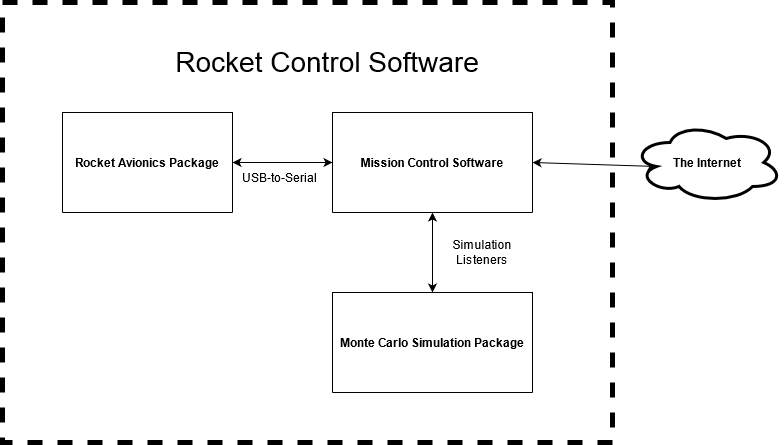
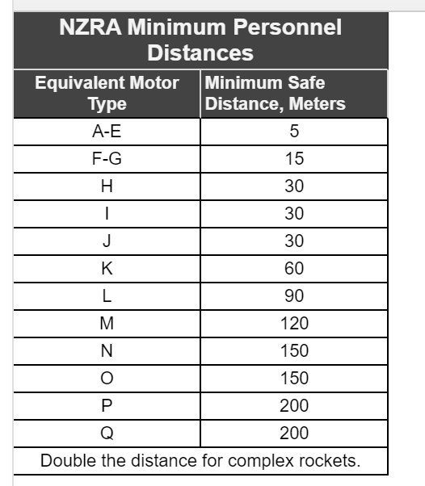

# ENGR 301: Mission Control Project Proposal and Requirements Document
<div style="page-break-after: always;"></div>


August Bolter, Claire Chambers, Bryony Gatehouse, Joshua Hindley, Bailey Jewell, Sai Panda 


## 1. Introduction

### Client

Our client is Andre Geldenhuis, and he can be contacted via the ecs mattermost, or via email at andre.geldenhuis@vuw.ac.nz.

### 1.1 Purpose

Andre has contracted us to create mission control software for a hobby rocket launch, control, and recovery system. 

### 1.2 Scope

The Mission Control Software is a multirole software package that facilitates pre-launch, mid-launch, and post-launch activities.
It will identify favorable launch conditions, set the starting conditions for a rocket launch. 
During the launch it will monitor the rocket, reporting its status and position.
After the launch it will report the rockets position for manual recovery. 
This software will facilitate the goal of making hobby rocket launches safer for both the users and the community, as well as aiding in convenience tasks like recovery.

### 1.3 Product overview 

#### 1.3.1 Product perspective

The Mission Control Software is part of a larger software system to facilitate the launch and control of a hobby rocket.
The Mission Control Software will interface with both the user and two other software packages, namely the Monte Carlo Simulation Package and the Rocket Avionics Package.
The role of the Mission Control Software is to find potential launching sites, facilitate pre-launch procedures such as arming the rocket and finding an optimal
launch profile. The control of the rocket mid flight is handled by the Rocket Avionics Package and the simulation of rocket flights is handled by the Monte Carlo
Simulation package, respectively. The Mission Control Software will have to interface with those software packages to fulfill its functions.

Specifically:

* The MCS will have to interface with the Rocket Avionics Package to get the real-time position of the rocket to facilitate tracking and recovery
* The MCS will have to interface with the Rocket Avionics Package to arm the ejection charge and set the desired rocket orientation
* The MCS will have to interface with the Monte Carlo Simulation Package to identify probable landing sites to facilitate screening possible launch sites.

The Mission Control Software will integrate with the Rocket Avionics Package and the Monte Carlo Simulation Package using USB Serial over radio and Java Simulation
Listeners with OpenRocket, respectively.



To interface with the Monte Carlo Simulation Package, the following software packages will be required:

| Name | Mnemonic | Version | Source | Purpose |
| ------ | ------ | ------ | ------ | ------ |
| Java Runtime Environment | JRE | 1.8 or later | Oracle | Creating environment for MCS, dependency for OpenRocket |
| OpenRocket | OR | Version 15 | OpenRocket | Creating environment for Monte Carlo Simulation Package |

The interface with OpenRocket/Monte Carlo Simulation Package will be through simulation listeners and the automatic creation of simulation files, which are in XML.

The Mission Control Software will operate on a PC with the Java VM running any major operating system, most likely a laptop. It'll require enough free memory and 
processor capacity to run both the Mission Control Software and the Monte Carlo Simuation Package, which would likely amount to 2GB (not accounting for memory used
by the operating system) and a dual core x86 processor (additional capacity may be required on an ARM platform).

The PC must also have one free USB port to operate the serial over radio interface. The PC must also have a standard keyboard/pointing device combo to operate the
Mission Control Software. The Mission Control Software will be a standard desktop application which can operate at full or half-screen.

Communication with the internet is required for the pre-launch site determination, as the Mission Control Software needs to download weather data from NOAA to facilitate
creating simulations for the Monte Carlo Simulation Package.

The Mission Control Software will also be indirectly be interfacing with a device that gathers local weather conditions, which the users of the software will use
and manually transcribe the data into the software via the user interface.

#### 1.3.2 Product functions

The Mission Control Software has a role in facilitating pre-launch, mid-flight, and post-flight responsibilities.

The primary pre-launch function of the Mission Control Software is to select potential launch sites. This is done at the user's home or place of work where they have
an internet connection, in which the user will select launch sites that they have access too, and the software will use current weather conditions to predict whether
a launch there would be safe. Safety is determined by their being a sufficiently low probability that the rocket will land in a populated area or otherwise breach 
rocketry regulations. Once at the selected landing site, a second round of simulations is run using the weather data available from the ground of the launch site, 
to determine a final go or no go for launch. Probability is calculated by consulting the Monte Carlo Simulation Package.

If a go is given, the Mission Control Software is responsible for remotely arming the rocket's ejection charge and setting an optimal orientation for the rocket that will
minimize how far it lands from the launch site. This is accomplished by communicating with the Rocket Avionics Package.

When in flight, the Mission Control Software monitors the rocket over radio, recording flight paramaters such as position, orientation, velocity, and acceleration, as
well as stage information. This data is saved for futher dissection by the user.

After the rocket lands, the Mission Control Software will provide the user with the location of the rocket so that they can safely recover it for potential re-use (and
to avoid contamination of the environemnt)

A minmim viable version of the Mission Control Software would encompass the launch site selection and providing the location of the rocket. 

#### 1.3.3 User characteristics   

NZ Rocketry Association (NZRA) 
The NZRA are a group of people who are interested in model rocketry and
build model rockets which are launched every year. They range from model rocketry that
leans more towards learning, safety and creativity, to advanced rocketry which includes
extreme speeds and a goal of heading for space.

The age range in the NZRA goes from Primary School kids to the elderly. They all have a
keen interest in developing rockets and expanding their knowledge about rocket science.

The NZRA have a National Launch Day every year where rockets ranging from small-scale homemade
ones to 6 meter factory built ones are launched. There are numerous videos of their launch days
on their website.

Our mission control software could be utilised in their national launch days, our "go no go" and "determine probable landing location" functions may prove to be helpful.
They have a similar set up to our project proposal, where a laptop controls an ejection charge under the rocket. They also do
numerous check such as "sky is clear, ranges are clear" before initaiting the countdown.

Considering the characteristics of our users, our Mission Control Software should have a simple user interface. 
Primary school students and the elderly are a part of our userbase, so having a simple user interface will allow the software to be usable by a larger audience. <br>
The software should also try to minimise the use of jargon. Not everyone will understand the technical terms that define aspects of software systems. 
As in, if there is invalid input from the user, instead of saying “That input has caused a NumberFormatException”, a helpful error message such as “The rocket length field only accepts numbers as input” is more informative and readable, especially to a non-technical audience. 

Our program should also support large and complex rockets as well. The NZRA is also known for building large scale rockets, which have 
a much bigger landing zone and will pose a greater safety risk. So, making sure our program is extendable to these types of rockets will 
also allow those users to use our software.


https://www.nzrocketry.org.nz/
https://www.facebook.com/groups/nzrocketry/

#### 1.3.4 Limitations

##### 1.3.4.1 Regulatory 

The regulations our rocket needs to follow depends on the motor power range of the rocket.  
  
Source: [1]  


Motor power range is determined by the minimum safe distance (in meters). 
Motor power range A-D can use the regulations as a guide, E-F need to follow the regulations and G+ need to follow additional regulations as well.

The regulations are specified in the NZ Rocketry Association (NZRA) Safety Code [1].
It is ideal for our software to be flexible (to work with any rocket). Therefore, our software for the rocket should conform with regulations specified for motor power range G+ since if the software is suitable for G+ it will also be suitable for motor power ranges below G.

In NZRA High Power Rockets (rockets with a motor type G or higher) Safety Code one of the regulations states the rocket must comply with the Civil Aviation Authority of New Zealand (CAA) Rule Part 101 [2].
So, our rocket must comply with the regulations stated in this rule as well.

##### 1.3.4.2 Hardware
There are a few potential hardware limitations such as: 

*  The rocket not having internet at the launch site which could impair our software’s ability to get weather data.
*  The launch site could also be outside the range for GPS communication which would affect the rockets' GPS ability.
*  The rocket will be controlled in the air by gimballing the motors however, this will only work while the motor is burning
*  The accelerometer the rocket will use needs to be powered by a stable, constant current supply to reduce noise on the signal generated by it.

##### 1.3.4.3 Interfaces to other applications
The rocket will have various sensors so, it is important to make sure our software accounts for the delay and range these sensors will have.
Our software also has to account for the transmission time for sending the weather data to the monte carlo and for receiving information about the rocket (e.g. GPS locatio)

##### 1.3.4.4 Parallel operation
If the rocket uses transformers that operate in parallel there are a few limitations associated with this such as:
*  Increasing the necessary breaker capacity
*  Could potentially create circulating currents running from one transformer to another which will diminish load capability and increased losses.

##### 1.3.4.5 Audit functions
Our software will need to be 'audited' (i.e. checked that it is working as intended). Functions created in auditing tools such as JUnit are limtied by the language they are written in and the functionality of the tool itself.

##### 1.3.4.6 Control functions
The control functions in our software determines whether it is safe for the rocket to launch (e.g. Go no-go function) however, once the rocket is in flight our software has no control over it (can't affect its' movement)

##### 1.3.4.7 Higher-order language requirements:
Our software will likely be written in Java. Java like any other language has limitations such as;
*  Memory allocation and garbage collection being automatic (means the user has less control over their software)
*  Java compiler being not as well optimised as compilers for other languages (e.g. C++)
*  User interface libraries in Java such as Swing are limited in customability and functionality.

##### 1.3.4.8 Signal handshake protocols
The rocket will use signal handshake protocols such as TCP 3-way-handshake to establish connections between its' interfaces. The limitation of this is performing the handshake isn't instantenous so the communication between interfaces will have a delay.

##### 1.3.4.9 Quality requirements
Our software for the rocket and the rocket itself will be limited in the sense that they will need to conform to quality requirements (e.g. reliability).

##### 1.3.4.10 Safety and security considerations
Our software for the rocket and the rocket itself will need to follow any relevant safety and security procedures and regulations. This could limit the ability of the rocket for example, the size of the rocket may need to be reduced to fit safety regulations.

##### 1.3.4.11 Physical/mental considerations
Our teams' wellbeing is a limitation as well. In the sense that mental problems such as sleep deprivation, stress, anxiety and physical problems such as RSI could affect the quality of our software.


## 2. References

[1] NZ Rocketry Association, "NZ Rocketry Association - Rocket Safety," [Online]. Available: https://www.nzrocketry.org.nz/rocketry/rocket-safety. [Accessed 24 May 2020].  
  
[2] Civil Aviation Authority of New Zealand, "Part 101 Gyrogliders and Parasails, Unmanned Aircraft (including Balloons), Kites, and Rockets Operating Rules," 27 September 2019. [Online]. Available: https://www.aviation.govt.nz/rules/rule-part/show/101. [Accessed 10 June 2020].  
  
[3] Civil Aviation Authority of New Zealand, "Part 101 Gyrogliders and Parasails, Unmanned Aircraft (including Balloons), Kites, and Rockets Operating Rules," 27 September 2019. [Online]. Available: https://www.aviation.govt.nz/rules/rule-part/show/101/4. [Accessed 10 June 2020].

## 3. Specific requirements  

### 3.1 External interfaces

#### 3.1.1 Rocket
The rocket itself will communicate with mission control through LoRa (Long Range WAN) over USB serial. The data pipeline from the rocket can be described as follows:
```
Rocket Avionics <-> LoRa module <-> LoRa module <-> ground station electronics <-> USB serial <-> Laptop
```
#### 3.1.2 Weather Data
As internet is not guaranteed in the field, weather data will be loaded prior to launch. 

##### 3.1.2.1 OpenWeatherMap
Weather data is available from [OpenWeatherMap](https://openweathermap.org/api). Current wind speed (m/s), direction(degrees) and gust speed(m/s) is available through their web API. Temperature, humidity, visibility and rain data is also available. The data is provided in JSON format.
```
api.openweathermap.org/data/2.5/weather?lat={lat}&lon={lon}&appid={your api key}
```
##### 3.1.2.2 NOAA
NOAA has a [Global Forecast System](https://www.ncdc.noaa.gov/data-access/model-data/model-datasets/global-forcast-system-gfs) that provides historical records and weather predictions. This data is available from the NOAA National Operational Model Archive and Distribution System ([NOMADS](https://www.ncdc.noaa.gov/nomads/documentation/user-guide)) through FTP. This data may require a large amount of preparation in order to be useful and may require a degree of meteorological expertise to accurately parse. Additionally, there is a [JSON API](https://www.ncdc.noaa.gov/cdo-web/webservices/v2#gettingStarted) for climate data access.

The Cambridge University Spaceflight Wiki has produced a [balloon flight predictor](http://predict.habhub.org/) using this dataset. This open source implementation may provide some insight into handling this data.

#### 3.1.3 Map Data
Map data is available from [OpenStreetMap](https://www.openstreetmap.org/). This low level data can be accessed through their API. This is important for providing relevant contextual information regarding the rocket's flight path.

#### 3.1.3 Simulation
The mission control software must be able to consume simulation data in order to determine whether or not launch conditions are met. The simulation will be based upon the [OpenRocket](http://openrocket.info/) software. [Simulation listeners](http://wiki.openrocket.info/Simulation_Listeners) may be used to extract data from the simulation, such as a [roll control listener](http://www.soupwizard.com/openrocket/code-coverage/eclemma-20121216/OpenRocket/src/net.sf.openrocket.simulation.listeners.example/RollControlListener.java.html).

#### 3.1.4 Launch Control
The mission control software is not responsible for issuing the launch command; the rocket will be launched through a seperate mechanical system. Mission control indicates whether or not launch conditions are met ("go or no go signal"). 

#### 3.1.5 User Interface
The mission control software is to be controlled using a keyboard and mouse driven desktop GUI, displayed on a normal laptop screen with a resolution of at least 1024x768.

Data is to be displayed in a human readable format and should be augmented with graphical visualisations.


### 3.2 Functions

#### 3.2.1 Get remote weather data from internet

The software must be able to pull weather data from an API (such as openweathermap or NOAA) and supply that data to other parts of the system. 
This data must be as accurate and up to date as possible, since incorrect data can have a severe impact on functionality. 
Determining probable landing locations and the "go no go" functions are two important aspects of the system 
that heavily relay on accurate weather data, so data correctness should be ensured. 
    
Alternatively, there is an API on the National Oceanic and Atmospheric Association (NOAA) website. 
This API allows for 5 requests per second and a total of 10,000 requests per day. All responses from this API
are in JSON. 
    
#### 3.2.2 Enter local weather data

An internet connection is not guaranteed at our launch site, so it is appropriate to consider methods to
manually gather local weather data and input it into our software. Our software should have a form with specified inputs
that will need to be gathered (i.e. temperature, wind speed). Specific units (preferably metric) should be used to avoid any confusion
and invalid calculations. 
    
Specialised tools are available for people to gather their own weather data. To calculate the wind speed, 
an anemometer can be used. An anemometer has multiple arms attached to a vertical rod. As the wind blows, the cups on the edge 
of the arms rotate and the anemometer counts the number of revolutions per second to calculate the wind speed.
Thermometers can be utilised to measure the temperature, and barometers can be used to measure air pressure.
There are multiple methods and tools to measure the weather manually and if needed, will be decided in future meetings.

    
https://openweathermap.org/api 
https://www.ncdc.noaa.gov/cdo-web/webservices/v2

#### 3.2.3 Determine probable landing locations<br>

The system must use the local weather conditions, and an external Monte Carlo simulation in order to determine, and display to the user, the probable landing locations of the rocket if it were launched in the current conditions. The minimum viable product is comprised of this use case, among others.

| Name | Determine Probable Landing Location |
| ------ | ------ |
| Participating Actors | Launcher (an individual who intends to launch a rocket) |
| Event flow | 1. Launcher indicates to the system that they intend to launch <br>2. The system uses GPS coordinates to get the local weather data from NOAA<br>3. The system sends the local weather data to an external Monte Carlo simulation <br>4. The system receives a set of probable landing locations from the Monte Carlo simulation <br>5. The system displays the probable landing locations graphically to the launcher <br>6. The system indicates to the launcher the probability of the landing zone being acceptable/safe <br>7. The system indicates to the launcher that it is safe to launch<br> **Alternative: not safe to launch**<br>7a. The system indicates to the launcher that it is unsafe to launch<br>7b. The system suggests changes for the launcher to make to change the probable landing locations<br>7c. The launcher makes changes to the parameters (e.g. rocket angle) <br>7d. The launcher enters their changes into the system <br> Return to Step 2 <br> **Alternative: launcher enters weather conditions** <br>2a. The launcher can choose to enter the local weather conditions manually<br> 2b. The system prompts the launcher to enter all the relevant local weather conditions <br>2c. The launcher enters the local weather conditions <br> Return to Step 3 |
| Entry Conditions | The system must be connected to a rocket over serial.<br> An external Monte Carlo simulation that the system can connect to exists. <br> The system can access NOAA or the launcher knows the specific local weather conditions. |
| Exit Conditions | The launcher is notified of the probable landing locations and whether it is safe to launch. |
| Special Requirements | The Monte Carlo simulation must simulate the launch correctly and determine probable landing locations accurately. <br> The system must be compatable with the operating system it is being run on. |

##### 3.2.3.1 
As a part of determining the probable landing locations, the system must connect to an external Monte Carlo simulation, written by another team. The system must send the local weather data obtained from NOAA, or entered manually by the user to the Monte Carlo simulation as well as additional information regarding the rocket.

##### 3.2.3.2 
As another part of determining the probable landing locations, the system must be able to receive and store the data that results from the Monte Carlo simulation. This may involve receiving the data directly from the Monte Carlo simulation, or loading the data from a file that the Monte Carlo simulation saves to.

##### 3.2.3.3
The final part of determining the probable landing locations is displaying the data. The system must display the simulation data visually to the user by showing the user probable landing locations on the map of the local area using a GUI. The displayed information should contain different ranges and confidence intervals.<br><br>

  
##### 3.2.4 Go/No go function <br>

The system must have a go/no go function. This function will define the area that is acceptable for the rocket to land in. The system must turn the acceptable area, a tolerance and the probabilities of landing in the acceptable area into a go/no go signal. If the system produces the no go signal, the rocket will be blocked from lauching. The goal of the go/no go system is to minimize the risk of injury or damage to the equipment by preventing a launch from taking place if certain conditions are not met. The minimum viable product is comprised of this use case, among others.

| Name | Go/No Go  |
| ------ | ------ |
| Participating Actors | Launcher (an individual who intends to launch a rocket) |
| Event flow | 1. The launcher indicates to the system that they intend to launch<br> 2. The system defines an acceptable landing area<br> 3. The system uses the probability of landing in an acceptable area with a tolerance to determine whether to send the go or no go signal<br> 4. The system indicates to the launcher that it is safe to launch <br>5. The launcher tells the system to launch the rocket <br>6. The system performs launch checks <br>7. The system sends a signal to the rocket to begin the launch procedure <br>8. The rocket is launched after a countdown<br> **Alternative: not safe to launch** <br>4a. The system sends a no go signal to the rocket, preventing it from launching <br>4b. The launcher is told that the launch cannot commence. <br> **Alternative: pre-launch checks fail** <br> Go to 4a. <br> **Alternative: the launcher cancels the launch** <br> 8a. The launcher indicates to the system that the launch should be cancelled <br>8b. The system cancels the launch <br> 8c. The launcher is notified that the launch has been cancelled |
| Entry Conditions | The system must be connected to a rocket over serial. <br> The system must have access to a map of the area. <br> The system must have a list of probable landing areas and their probabilities. |
| Exit Conditions | The rocket has been launched (go) or the launch was cancelled or not approved (no go). <br> The launcher has been notified of the outcome. |
| Special Requirements | The system and the rocket must be able to communicate to each other. <br>The system must be compatable with the operating system it is being run on. |

##### 3.2.4.1 
The system must define acceptable areas. That is, the system must determine an area surrounding the launch zone that it is acceptable for the rocket to land in. The area that the system defines must be an area that does not include residential ares, and does not breach rocketry regulations.

##### 3.2.4.2
The system must use the acceptable areas it defines with the probability of landing in an acceptable area with a tolerance to determine whether it is safe to launch. If the probability of the rocket landing in an acceptable area is too low, the system will send a no go signal to the rocket, indicating that a launch is not approved. If the probability of the rocket landing in an acceptable area is high enough, the system will allow the user to launch the rocket.

##### 3.2.4.3 
The system must perform pre-launch checks before the user goes to the launch site. These checks will ensure that, with the current weather, the launch site chosen by the user will be acceptable. These checks will ensure that the location the user chooses as a launch site is not in a residential area, and will not result in a break of rocketry regulations.

##### 3.2.4.4
The system must perform launch checks on location at the launch site. These checks will ensure that the correct go/no go decision has been reached given the actual launch site and current local weather conditions. Additionally, the checks at this stage will involve communicating with the rocket to check that all the rocket's systems are nominal before the system allows the user to begin the launch procedure.<br><br>


#### 3.2.5 Relaying rocket information to user interface.
Specifically, relaying the rocket's location, velocity, and rotation<br>
5a.   Showing GPS location on a map<br>
5b.   Showing diagram of rocket with rotation and velocity<br>
5c.   What to do when you can't contact the rocket<br>
5d.   Recording it to a file<br>
5e.   Playing back that file virtually<br>

#### 3.2.6 Suggesting launch angle 
The application can determine the correct launch angle for the rocket to follow the desired trajectory. This will take into account environmental factors such as wind speed. This is important to maximise the chance that the rocket lands in the desired landing zone. 

This data may be calculated from the mission control software itself, or passed on from the Monte Carlo simulation.

#### 3.2.7 Arm ejection charge
Ejection charges are controlled by the avionics team, with their detonation time determined by the the rocket's flight stage through barometric pressure or time. The ejection charges should only be armed pre-launch, with the mission control software indicating when launch conditions are met.

Upon detonation of a charge, this information should be displayed in the mission control software.

There are a number of ways that mission control can determine whether charges have been detonated. Firing the charges results in a large voltage drop, which when corroberated with a predetermined expected detonation time, changes in pressure and expected change in flight path provides an indication that the ejection charge has been deployed successfully.


### 3.3 Usability Requirements

*  Entering the local weather data needs to be quick and easy to do. This is so that the go no-go function can calculate as quickly as possible whether it is safe for the rocket to launch.
*  When displaying the rocket's data, the units shown should be well known. This is to prevent the user from getting confused.
*  The rocket software should work in areas without internet since it is not guaranteed that the launch site will have internet.
*  The software for the rocket should function correctly in different weather conditions (e.g. high wind, rain, snow).
*  If contact with the rocket is lost then the user should be notified immediately.
*  The user should have a clear idea of where the rocket is (e.g. visualising the rocket's location to the user).
*  The suggested launch angle calculated must be a realistic and safe launch angle (e.g. suggested launch angle can't have a huge horizontal velocity).
*  The rocket software should comply with regulations for any rocket. This is so that other people can use our software for their rockets.
*  Playing back the recorded file that holds the rocket's details should be easy and quick to do since displaying the information quickly is critical.
*  Calculating the upwind trajectory should be reliable and accurate.
*  Calculating the probable landing locations should be reliable and accurate.
*  The Mission Control Software should let the rocket know when launch is imminent as soon as possible.
*  The software will allow users to select proper launch sites and will help them identify unsafe areas.
*  The software will facilitate recovering the rocket with GPS tracking if something goes awry.

### 3.4 Performance requirements

#### 3.4.1 How often the position of the rocket is updated on the map<br>
This will be a tick-based update where each tick can be a specified 
number of milliseconds, say 500ms for example. Every 500ms, the positional data
of the rocket can be retrieved and then be processed at mission control to
then be displayed on the map. At a tick rate of 500ms, the rockets position will be
updated 120 times over the course of 1 minute. 
The latency between the rocket and mission control will need to be considered. As the rocket
travels further away, the connection is likely to get weaker, so a variable tick-rate may be considered. 

#### 3.4.2 No 'go' given on failure probabilities of greater than X%
As part of our go no go functionality, we will be calculating a probability of failure based on current conditions. 
These conditions can range from the current weather (i.e. wind speed or temperature) to the strength of the connection between 
the rocket and mission control. Each condition could be given weights (that are calibrated beforehand) which signify their 
overall impact as a cause of failure during the rocket launch. 
We will set a probability threshold at a value that will be decided in the future. If the probability of failure is greater than or equal
to our predefined threshold, then the rocket will be given the "no go", signifying that the chance of failure is too high.  

#### 3.4.3 Number of Simultaneous users
Our program can have infinitely many users. However, each computer can only support one instance at a time and that instance can only support one rocket at a time. 

#### 3.4.4 Amount and Type of Information to be handled 
The system should be able to handle as much information as the USB serial can send at its optimal performance. 
If the serial can transmit a high amount of data that we cannot cater to due to our technical
limitations, then we will aim to get as close to this as possible.

As for the type of information to be handled, our system will be data agnostic meaning that it can
parse and output any of the three major data file formats which are:
- JSON
- XML
- CSV

The format of the incoming data will be dependent on what format the Avionics team decide on. 

#### 3.4.5 Map Data Caching 
An internet connection at the launch site is not guaranteed. So, prior to launch, our software should be able to 
cache map information of a 2km radius of the launch site. That way, map data at launch can be accessed without 
the need for an internet connection. 

#### 3.4.6 Minimum Map Precision 
Our software should have a minimum precision of 3 metres on map features. That is, features must be no more than 3 metres away from their true position (i.e. the rockets positional data should always be within 3 metres of it.)

#### 3.4.7 Maximum GUI response time
The GUI must have a response of time of less than 25 milliseconds. External factors such as network requests are exempt from this requirement. 

#### 3.4.8 Rocket Data Incorporation
Once data is received from the rocket (whether it is pre, during or post launch), it must be incorporated (parsed and interpreted) into our system in under 100 milliseconds. 

#### 3.4.9 Maximum System Memory Consumption
At its peak workload conditions, the mission control software should not be consuming more than 750 megabytes of memory at any given time. 

### 3.5 Logical database requirements

As it stands, this question is unanswerable. Information is first required from the rocket teams and Monte Carlo teams as to what data they will transmit to the mission control software.

Our current best guess for the data the mission control software will receive from the rocket is position, rotation (pitch, roll, yaw) and speed. The current best guess for data that will be obtained from NOAA includes windspeed, barometric pressure, temperature and rainfall. There is currently no best guess for the data that will be received from the Monte Carlo software.

```
See 9.5.14. for most systems, a focus on d) and e) is appropriate, such as an object-oriented domain analysis. You should provide an overview domain model (e.g.  a UML class diagram of approximately ten classes) and write a brief description of the responsibilities of each class in the model (3 pages).

You should use right tools, preferabley PlantUML, to draw your UML diagrams which can be easily embedded into a Mardown file (PlantUML is also supported by GitLab and Foswiki).
```

### 3.6 Design constraints  
  
**Design Constraints**  
The system’s design is constrained by the New Zealand Rocketry Associations (NZRA) regulations [1] (their safety code) for model rockets. Though the safety code is focused on the rocket’s hardware rather than the software some of these regulations also affect the software of the rocket. For example, one of the regulations is that a countdown must be used before launch to ensure everyone is 10m away from the rocket before it launches. This means our software must account for this (i.e. only give clearance for the rocket launch after the countdown). 

Other regulations that constrain our software designs include:
*   Launcher - “A launching device shall not be used to launch a high power rocket at an angle more than twenty degrees (20″) from vertical.” – The horizontal angle calculated by our software must be no more than 20 degrees from vertical
*   Flight Safety - “I will not launch my rocket at targets, into clouds, or near airplanes, and will not put any flammable or explosive payload in my rocket” – Our Go-NoGo function should only respond a Go signal (rocket can launch) if there are no clouds, objects (like airplanes) or people in the rocket’s simulated path
*   Wind speed – “A person shall not launch a high power rocket if the surface wind at the launcher is more than 32km/hr” – Our Go-NoGo function should only respond with a Go signal (rocket can launch) if wind is 32km/hr or less.
*   Launch site – “In no case shall the minimum launch site dimension be less than 450m” – Our software must operate correctly with the rocket in a launch site that has a maximum dimension of 450m. 

The Civil Aviation Authority of New Zealand (CAA) also outlines regulations that rockets must follow in Part 101 [2]. Like, NZRA their regulations are social and physical regulations rather than software regulations. However, some of these regulations also are applicable to software. For example, in the rocket section of Part 101 [3] CAA states that the horizontal visibility must be 8km or greater and that the rocket can’t be flown into clouds. Our software (in particular our No-Go function) will need to have checks to ensure the rocket follows these regulations. 
Our project also has limitations which can constrain our design. The limitations and how they constrain are design is shown in the table below.

| Limitation | How it constrains our design |
| ------------- |-------------|
| Low budget due to our team being consisted of students | We will be limited to using cheap/free Integrated Development Environments (IDE’s) |
| Auditing (Audit functions) | Our software will need to pass all test cases (auditing) we create. |
| Programming Language (Java) | We plan to use Java as it is all the language we are most comfortable with. However, Java constrains what we can do in our code (e.g. can’t manually dynamically allocate memory) |
| Physical/mental considerations | Our design is limited by our lack of experience completing full-scale projects |
 
**Standards Compliance**  
Report format:  
Any reports we create should follow IEEE format in the sense that they should have IEEE references and should reference IEEE documents if applicable.  
  
Data naming:  
Variables, fields, constants and any other container that holds data in our software must follow the naming convention specified in the [code style standard](https://gitlab.ecs.vuw.ac.nz/course-work/engr300/2020/group9/group-9/-/blob/master/CONTRIBUTING.md) we created.

Audit Tracing:  
Sensitive and important data should be logged correctly and safely (e.g. using a logging library (e.g. log4j)) and any changes to this data should also be logged. This is so that if a something goes wrong (e.g. error occurs, exception is thrown) then we can trace it back to the source and identify the issue.


### 3.7 Nonfunctional system attributes

#### 3.7.1 Systemic (Nonfunctional) Requirements 

#### 3.7.2 Availability
The mission control software will be available for use as long as the repository hosting the software exists. 

#### 3.7.3 Security
Special care will be taken during development to ensure that the software has high security. After development has finished, the project team will no longer be updating the code base and hence the security level will remain the same.

#### 3.7.4 Effectiveness
The software will be as effective as the team can make it. During development, the aim will be to make the most effective and efficient version of the software. However, once the project is finished, new software for the same purpose by a different team may be available for use, which may surpass our software in terms of effectiveness and efficiency.

#### 3.7.5 Usability
Much like the effectiveness of the software, the project team will aim to make the software as usable as possible. Our stakeholder age range is quite vast (from primary school kids to the elderly) so we need to be certain that the mission control software is easily usable by/for multiple age groups.

#### 3.7.6 Interoperability with Existing Systems
The mission control software is designed to interpolate with other projects being developed simultaneously. These projects are the Rocket Systems Engineering project and the Monte Carlo Rocket Simulation project. Our software is not aiming to be interoperable with any other existing systems besides those previously mentioned.

#### 3.7.7 Retirement
If the decision to retire the software (i.e. it is deprecated) is made, then no sensitive data will need to be deleted / retained by the developers. This will rely upon on the stakeholders themselves as all logging data will be saved on their local machines as opposed to cloud storage.

#### 3.7.8 Obsolescence Management
As stated above, the software may be surpassed by newer effective software, which may leave our software obsolete. At this point, the development team may have a disclaimer on the repository to state that the software is now deprecated / obsolete. Unless other developers extend the code base, the software will forever be marked as such.

#### 3.7.9 Adaptability
Our software is going to be data agnostic, meaning that it will support multiple data formats. More specifically, these data formats are JSON, XML and CSV. As data formats evolve, a new and more effective data format may become available. While support for this new data format may be beneficial, the development team will not be updating the program to be able to handle it. This will again, be up to other developers and hobbyists who can extend the code base.

#### 3.7.10 Scalability
During development, the team will increase its functionality based on the Stakeholders needs. This will not be the case after development, but the open source nature of the software will allow for others to increase the scalability of the program.

#### 3.7.11 Survivability
The software will incorporate multiple fail safes and will utilise proper handling of safety critical systems. 

#### 3.7.12 Deployment 
The mission control software will be hosted on a repository from which users can download it from. Tags will be attached to each major version as development continues. 

#### 3.7.13 Documentation
All our code will be clearly documented with clear and concise comments. We will also include a readme file on the repository which will explain how to use the software. 

#### 3.7.14 Response Time
Our user interface should have a response time less than 25 milliseconds. However, external factors such as network requests are exempt from the requirement.  

#### 3.7.15 Privacy 
There is no persistent storage of the user’s data in our software. Regardless, the software will comply with all relevant privacy laws. 

#### 3.7.16 Testability
The process of testing our software should be as easy as possible. Our test cases should achieve high coverage of the code. Testing is critical for ensuring the correctness of our software, so we will do everything we can to ensure that our software can be easily tested. 

#### 3.7.17 Platform Compatibility 
Our software should be compatible on as many platforms as possible. However, we will not be supporting old or deprecated versions of current software (I.e. the software will be compatible with Windows 10, but not Windows XP). The major platforms we will support are Windows 10, macOS and Linux. 

#### 3.7.18 Open Source 
The mission control software will be open source, it will be hosted in a Git repository. This allows users of the software to directly contribute to its code base after the team has finished their development. 

### 3.8 Physical and Environmental Requirements

#### 3.8.1 Physical Requirements

The device running the program must have enough space in its memory to download the program and save the files (log, weather and map data). This allows the program to run properly (or run at all).

The device must be able to recieve information through the USB serial, therefore it must have a USB port or be able to use an adapter to accept a USB device.

The device chosen to run the program on must be portable (eg. laptop) as it will be used in the field. The rocket and computer must be close enough to connect through USB Serial while the rocket is in flight.

The device must have enough charge to run the software. The program must work as efficiently as possible to reduce the power consumption.

#### 3.8.3 Environmental Conditions

The system must be able to receive a signal from the rocket while it's on the ground. It is preferred that the signal is also received while the rocket is in the air. Other radio signals or buildings could interfere with the transfer of the signal.

The system must be able to cooperate with the rocket API (designed by the avionics teams) and the Monte Carlo simulation (designed by the simulation teams). This includes communicating over USB Serial and to another software project (which might be a different language).

### 3.9 Supporting information

see 9.5.19. 

## 4. Verification

Code style enforcement via plugins, IDE settings
Stuff that we can unit/regression tests<br>
Stuff that we need to live test, such as with Monte Carlo<br>

3 pages outlining how you will verify that the product meets the most important specific requirements. The format of this section should parallel section 3 of your document (see 9.5.18). Wherever possible (especially systemic requirements) you should indicate testable acceptance criteria.

## 5. Development schedule.

### 5.1 Schedule

This project consists of three primary deliverables: an architecture prototype, a minimum viable product and the project termination. The architectural prototype should be completed by the 19th of June in week eleven of trimester one. Our team chose this date for the architectural prototype as it signifies the end of the first trimester and the end of the planning stage of the mission control project. After this deliverable has been delivered, the team can begin programming the mission control software, creating a skeleton proof of concept before arriving at a minimum viable product. The minimim viable product for our project is a program that can act as mission control for a hobby rocket launch without any bells and whistles. The minimum viable product should be fully functional, if bare-bones, in successfully allowing a user to launch a hobby rocket. Our team should deliver the minimim viable product by the 14th of August in week five of trimester two. We chose this date as it allows the team sufficient time to create the mission control program while also allowing plenty of time to receive feedback from the client and make changes and improvements the the product. The project should terminate on the 16th of October in week twelve of trimester two. Ideally, the complete version of the product should be finished much earlier and only minor quality-of-life changes should be made the the mission control program in the weeks leading up to the project termination. At this stage there are no plans for any further releases beyond project termination. 

### 5.2 Budget

No purchases required. It's a software project.

### 5.3 Risks 

#### 5.3.1 Sudden prolonged absence of a team member.
##### Likelihood: Low Effect: High.

The sudden prolonged absense of a team member is a schedule risk that can cause the project to run overtime. It is caused when a team member disappears for a long period without explanation. An example is if a team member is in a crash and is in a coma.

The impact of a sudden prolonged absense of a team member is that there is one less person working on the project. This means that that member's work would have to be split between the other team members and the project will take more time and effort to complete. 

To avoid the risks of a sudden prolonged absence, each team member will strive to:
- Offer an explanation if they are going to be absent.
- Add comments and notes into their work so it is easier for others to pick up.

To avoid the risks of a sudden prolonged absence of a team member, the team will strive to:
- Make sure each member knows about every different part of the project so they can start working on it.
- Have regular meetings with compulsory attendance to quickly notice a team member's absence.

#### 5.3.2 Sudden temporary absence of a team member.
##### Likelihood: Medium/High Effect: Low

The sudden temporary absence of a team member is a schedule risk that could cause decisions to be delayed. It is caused when a team member fails to remember a meeting, and is contactable during the meeting. An example is when a team member schedules their work during the meeting, thus is busy and away from their device.

The impact of a sudden temporary absence of a team member is that a decision isn't able to be made. This will halt progress on the project, potentially pushing it back past the deadline. 

To avoid the risks of a sudden temporary absence, each team member will strive to:
- Check the communication channel at least once a day.
- Avoid booking commitments during the lab times.
- Be available on the communcation channel during lab times.

To avoid the risks of a sudden temporary absence of a team member, the team will strive to:
- Have regular meetings at the same time every week.
- Notify team members about meetings outside of normal scheduled meetings at least a day before the meeting.
- Keep important decisions to the normal scheduled meetings.

#### 5.3.3 Loss of work due to technological problems.
##### Likelihood: Medium Effect: Low

Loss of work due to technological problems is a scheduling risk that could lead to the project not being finished on time. It is caused when a technological problem causes the file that was being worked on to be closed without saving the work. An example is when a blackout causes the desktop to shutdown before the file was saved. 

The impact of losing work due to technological problems is that work will have to be repeated. This might result in the final code being poorly written as the developer isn't thinking as hard about it. It will result in more work and time taken on the task. If the work lost is a lot, than it could delay the finishing of the project. 

To avoid losing work due to technological problems, each team member will strive to:
- Save their work regularly to keep an almost up-to-date version of their work.
- Work on all their work seriously, even if they are repeating it.
- Commit regularly to GitLab to protect against their device dying.

To avoid losing work due to technological problems, the team will strive to:
- Split tasks into smaller units so work done each 'task' is less.

#### 5.3.4 Failure to agree on protocol with the Monte Carlo teams. 
##### Likelihood: High      Effect: High

Failure to agree on protocol with the Monte Carlo teams is a performance risk that would stop the project from integrating with them. It would be caused by a disagreement with all the Monte Carlo teams over how the two projects will communicate. An example is this project not wanting to send a piece of information the Monte Carlo team were expecting.

The impact of failing to agree on protocol with the Monte Carlo teams is being unable to simulate the rocket's launch. This would lead to the system being unable to determine if a launch is safe.

To avoid failing to agree on protocol with the Monte Carlo teams, the team will strive to:
- Be willing to make compromises on agreements. 
- Outline what the system can actually do.
- Don't accept impossible terms. 

#### 5.3.5 Failure to agree on protocol with the avionics teams. 
##### Likelihood: High      Effect: High

Failure to agree on protocol with the avionics teams is a performance risk that would stop the project from integrating with them. It would be caused by a disagreement with all the avionics teams over how the two projects will communicate. An example is the avionics team wanting to send information that this project doesn't want to deal with.

The impact of failing to agree on protocol with the avionics teams is being unable to connect to the rocket. This would lead to the user not being able to control the rocket, or see information about the rocket's position. 

To avoid failing to agree on protocol with the avionics teams, the team will strive to:
- Be willing to make compromises on agreements.
- Outline what the system can actually do.
- Don't accept impossible terms.

#### 5.3.6 Other teams fail to meet deadline. 
##### Likelihood: Low       Effect: High

The other teams failing to meet deadlines is a schedule risk that would halt the testing or development of the project. This risk would only happen if all of the six teams working on the Monte Carlo/avionics project are all behind schedule. 

The impact of the other teams failing to meet deadlines is that the project deadlines will have to be pushed back to accomondate them. This will cause the project to be completed later than expected, and the team will be waiting around for it to be completed. 

To avoid the other teams failing to meet deadlines, the team will strive to:
- Clearly express when a component from another team is needed.
- Check up regularly on the progress of the component.

#### 5.3.7 Failure to meet deadlines. <br>
##### Likelihood: Medium     Effect: Low

Failure to meet deadlines is a schedule risk that can cause the project to run overtime. It is caused when some factor prevented the individual from completing their work. This could be due to having too much work on at a certain time, or a sudden external event like a blackout or injury. An example is when a team member has to fit in the project work while also studying for a test.

The impact of a deadline being missed is that the other parts of the project will be behind schedule. These effects could make the project be completed later than expected or cause extra pressure on the the rest of the team to fix the individual's mistake.

To avoid failing to meet deadlines, each team member will strive to:
- Only take on the amount of work they can physically complete within the time limit.
- Be willing to help others when they are struggling with a task.
- Be willing to ask others for help when they are struggling with a task.
- Be honest about the amount of other work they have to complete.
- Share if they have other circumstances preventing them from working early.

To avoid a team member failing to meet deadlines, the team will strive to:
- Plan work around other obligations or deadlines. 
- Have slack in the schedule so delays don't throw the project off track.

#### 5.3.8 Major scope creep.<br>
##### Likelihood: Medium/Low    Effect: High

Major scope creep is a cost risk that can cause the project to run overtime. It is caused when extra tasks are added to the project scope during the project lifetime, or when nominally simple functions are continually over-created. An example is when another requirement is added to the project specification.

The impacts of major scope creep are extensions to the project lifetime or extra work to the team to fit into the same lifetime.

To avoid major scope creep, the team will strive to:
- Carefully define the project specifications so there is no room for confusion. 
- Focus on finishing the project requirements before adding extra functions.
- Review the code regularly to spot wasted code early.
- Communicate about tasks.

#### 5.3.9 Bad documentation.<br>
##### Likelihood: Medium/High   Effect: Medium/Low

Bad Docmentation is a performance risk that can cause bugs in the program. It is caused when an individual fails to properly document their methods or classes. An example is when a developer fails to properly add comments and JavaDocs to their method.

The impact of bad documentation is that the method is incorrectly used or that the code is confusing to developers who are editing it. These effects could lead to bugs in the program which will increase the work for developers and testers and increase the time/cost of maintaining the program or adding new features.

To avoid bad documentation, each team member will strive to:
- Write a JavaDoc comment for every method.
- Add important comments to their code so that it can be understood by other team mates.
- Make sure that documentation can be understood by outsiders. 

#### 5.3.10 Injuries due to overwork. <br>
##### Likelihood: Medium     Effect: Medium

Overwork is a physical risk that can, in unlikely circumstances, cause death. It is caused when an individual works for an extended amount of time without decent rest or food. An example is when a student pulls an all-nighter for multiple consecutive days to finish an assignment or study for a test. 

The more likely impacts of overwork, other than death, are sleeping disorders, anxiety, and a weakened immune system. These effects will reduce the work quality of the individual and potentially stop them from working on the project.

To avoid becoming overworked, each team member will strive to:
- Only take on the amount of work they can physically complete within the time limit.
- Be willing to help others when they are struggling with a task.
- Be willing to ask others for help when they are struggling with a task.
- Be honest about the other work they have to complete.

To avoid a team member becoming overworked, the team will strive to:
- Share the work between the team so no one's doing all the work.
- Be flexible with deadlines.
- Work around deadlines for other courses.

#### 5.3.11 Computer-use related injuries.<br>
##### Likelihood: Low        Effect: High

Computer-use injuries are a physical risk that can lead to the individual not being able to use the computer. They are caused by continued use of a computer while using poor posture or repeating a similar action for a long period of time. Poor posture could be slouching, sitting straight upright, typing with a positive slope, looking down at the monitor or looking up at the monitor. 

The impacts often noticed of poor computer-use are back/neck pain, headaches, and arm pain. These effects could make the individual uncomfortable using the computer, thus reducing their speed or output, or making it too painful to use the computer at all.

To avoid a computer-use injury, each team member will strive to:
- Take regular breaks away from the computer during work to allow the body to stretch and relax.
- Stop working if something starts hurting and allow time for it to return to normal. If it doesn't, they should see a doctor.

To avoid a team member getting a computer-use injury, the team will strive to:
- Reduce length of online meetings.

### 5.4 Health and Safety

1. How the team will manage computer-related risks
    - Some risks were discussed in great detail in the section above (overwork, computer-use injuries, work loss due to technological problems).
    - Cable Management
        - Each team member will strive to keep their work station free of loose wires.
    - Security
        - No sensitive or personal data is stored or used by the program.
        - GitLab.ecs prevents people outside the university from accessing the online work.
    - Other risks
        - Up to team members to identify and mitigate depending on their unique situation.
        - Team members can ask for advice or help from other team members or the School Safety Officer.
        - Team members should share risks they've found with the team.

2. Whether the project requires any work or testing at an external (off-campus) site.
   - The project is a control for a rocket, but can be tested at an internal site using simulations. Thus it won't require off-campus testing.
   - Note: it will require testing under field conditions (no wifi) but doesn't need to be in the field.

#### 5.4.1 Safety Plans

As this is a software project, project requirements do not involve risk of death, serious harm, harm or injury.

## 6. Appendices
### 6.1 Assumptions and dependencies 

Communication with rocket will be over serial
Public weather data from NOAA exists and is accurate
The java VM continues to be supported

One page on assumptions and dependencies (9.5.7).

### 6.2 Acronyms and abbreviations

NOAA = National Oceanic and Atmospheric Administration
API = Application Program Interface


## 7. Contributions

A one page statement of contributions, including a list of each member of the group and what they contributed to this document.

